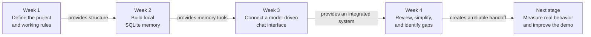
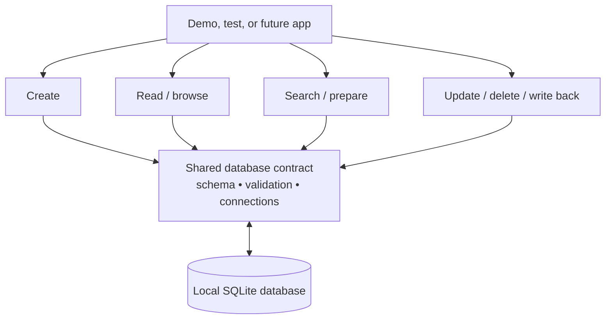
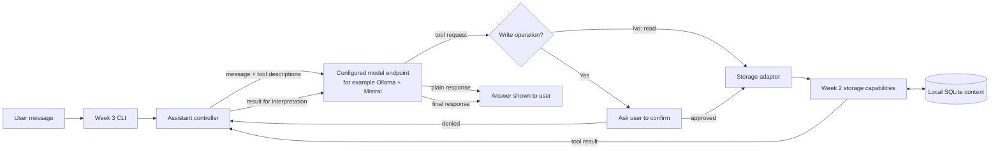
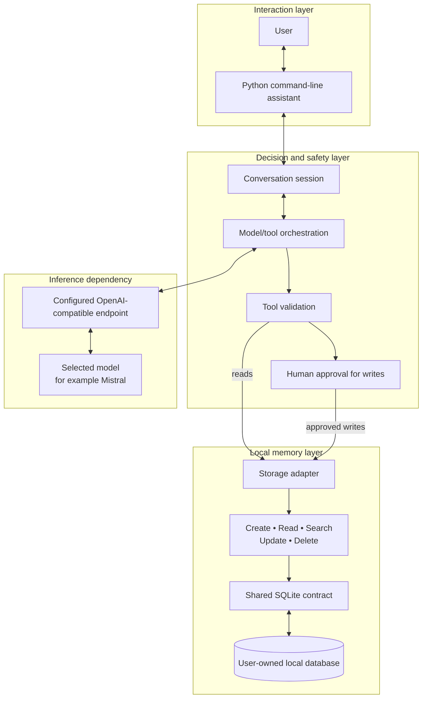

# Month 1 Implementation Review: The Story So Far

**Project:** Local-First AI Context Assistant<br>
**Period:** Month 1, Weeks 1–4<br>
**Review date:** 31 July 2026<br>
**Current review branch:** `week/month-01-week-04-cleanup-and-summary`

## Executive summary

Month 1 turned an empty project idea into a tested command-line assistant with local memory.

The work followed a deliberate order. Week 1 defined the problem, chose the first technologies, and created a repository that could support steady weekly development. Week 2 built the local memory layer in SQLite. Week 3 connected that memory to a configurable, OpenAI-compatible model endpoint and added a conversational command-line interface. Week 4 is consolidating the result, simplifying contribution paperwork, and recording the month-wide architecture and lessons.

The central idea is simple:

> The user owns a local SQLite database. A model can decide when that database is useful, but it can only reach it through a small set of controlled tools. Read operations can run directly; create, update, and delete operations require the user's confirmation.

The repository does **not** contain or simulate a language model. The Week 3 application calls a separately running OpenAI-compatible endpoint. That endpoint can be local—for example, Ollama serving Mistral—or remote if the user deliberately configures it that way. The Python `openai` package is the client protocol adapter; it does not require the hosted OpenAI service.

## Month 1 at a glance

| Week | Main question | What was completed | Result |
|---|---|---|---|
| [Week 1](#week-1--build-the-foundation) | What are we building, and how will the project grow safely? | Project brief, roadmap, repository structure, architecture notes, contribution workflow, Python starting point, and laptop/Python/SQLite decisions | A stable foundation and shared direction |
| [Week 2](#week-2--give-the-assistant-local-memory) | How can user-owned context be stored and managed locally? | Shared SQLite contract plus create, read, search, update, delete, persistence, and write-back capabilities | A complete local context store |
| [Week 3](#week-3--connect-conversation-to-local-memory) | How can a model use that memory without receiving unrestricted database access? | Interactive CLI, configurable model client, tool selection, storage adapter, write confirmation, streaming support, and offline tests | A model-driven local assistant flow |
| [Week 4](#week-4--review-clean-up-and-prepare-for-measurement) | What is complete, what needs cleanup, and what should happen next? | Simplified pull-request template and this month-level implementation review | A clearer handoff; benchmark implementation remains open |

## The month as one story



The important progression is **foundation → memory → intelligence → review**. Each week depended on the layer before it. Week 3 did not replace Week 2; it made Week 2's storage operations available to a model through a controlled interface.

## Week 1 — Build the foundation

### The problem

The project needed more than a code folder. It needed a clear purpose, a realistic first scope, a place for evidence, and a workflow that would remain understandable as more contributors and languages were added.

### What was established

- The [project brief](../../PROJECT_BRIEF.md) defined the Local-First AI Context Assistant as a system that stores user-owned notes and context locally.
- The [roadmap](../roadmap.md) divided a twelve-month learning project into small weekly outcomes.
- The [architecture guide](../architecture.md) described both the repository workflow and the intended application layers.
- Python was chosen for the first prototype, SQLite for local persistence, and a laptop as the initial compute target.
- Dedicated folders separated source code, tests, benchmarks, research, design artifacts, reports, and long-lived documentation.
- Contribution and verification rules made weekly learning and human review part of the engineering process.
- A tagged Week 1 baseline made the original starter state recoverable for future contributors.

### Why it mattered

Week 1 reduced uncertainty. It answered:

- What problem is in scope?
- Where should each kind of work live?
- How will contributors show what they learned and verified?
- Which technologies should be used first?

The initial executable and benchmark files were placeholders, not a finished application. Their purpose was to reserve clear entry points for later work.

### Week 1 outcome

At the end of the week, the project had a stable map but very little application behavior. The next logical need was local data storage.

**Evidence:** [Week 1 report](../../reports/month-01/week-01-setup.md) and [Week 1 baseline release notes](../releases/v0.1-week-01-baseline.md).

## Week 2 — Give the assistant local memory

### The problem

An assistant cannot usefully work with personal context unless that context can be stored, inspected, searched, changed, and recovered after the program restarts.

### What was implemented

Week 2 introduced a local SQLite context store with four responsibility areas:

| Area | Responsibility | Main module |
|---|---|---|
| Shared database contract | Database location, table shape, indexes, connections, timestamps, and validation rules | [`db_contract.py`](../../src/python/local_first_ai/storage/db_contract.py) |
| Create | Validate and save a new context item | [`create_context.py`](../../src/python/local_first_ai/storage/create_context.py) |
| Read and browse | List items, fetch one item, filter by type, and show recent items | [`read_context.py`](../../src/python/local_first_ai/storage/read_context.py) |
| Search and prompt preparation | Find matching context and rank useful results for inference | [`search_context.py`](../../src/python/local_first_ai/storage/search_context.py) |
| Manage and write back | Update, delete, prove persistence, and store inference output | [`manage_context.py`](../../src/python/local_first_ai/storage/manage_context.py) |

The shared contract is the key architectural choice. Every storage operation uses the same database location, schema, validation rules, and row format. This prevents separate features from quietly treating the same data in incompatible ways.

### What a context item represents

A stored item contains the user's information together with useful organizing details: its type, title, content, optional source and tags, importance, and creation/update times. SQLite stores these records in a local database file, so they remain available after the process ends.

### Week 2 architecture



### Week 2 outcome

The project now had reliable local memory but no natural-language controller. A developer could call storage capabilities directly, and the integrated demo could exercise them, but the system was not yet an interactive assistant.

**Evidence:** [Week 2 report](../../reports/month-01/week-02-local-storage.md), [integrated storage tests](../../tests/python/storage/test_week_02_local_context_store.py), and [test report](../../tests/python/storage/week_02_test_report.md).

## Week 3 — Connect conversation to local memory

### The problem

Week 2 exposed storage operations to Python callers. Week 3 needed to let a user speak naturally while keeping database access understandable and controlled.

### What was implemented

The Week 3 assistant added:

- An interactive command-line conversation.
- Runtime configuration for the endpoint URL, model name, API key, database path, and streaming choice.
- An OpenAI-compatible client that can talk to a separately running model server.
- A model-first routing flow: the model decides whether to answer normally or request one or more storage tools.
- Six tool groups covering list, search, read, create, update, and delete behavior.
- An adapter between the assistant and the Week 2 storage modules.
- Argument validation before a requested tool reaches storage.
- A confirmation gate before create, update, or delete can change local data.
- Conversation history and bounded tool-call iterations.
- Streaming output with safeguards that delay writes until a complete model response has been received.
- Offline tests using fake model clients, so core orchestration can be verified without downloading a model or starting a live endpoint.

### The Week 2 → Week 3 connection



### Why the model is separated from the repository

The application contains the orchestration, not the model itself. This separation allows the same assistant flow to use any server that provides the expected OpenAI-compatible chat interface and tool-calling behavior.

For a fully local setup, the path can be:

```text
Command-line assistant → Ollama endpoint → Mistral model
                       ↘ local SQLite database
```

Using the `openai` Python package therefore describes the API format used for communication. It does not mean requests must go to OpenAI. Privacy still depends on configuration: data stays on the machine only when the configured endpoint is also local.

### Safety boundary

The model may propose an action, but the application remains responsible for validation and execution. Read tools can inspect context. Write tools require explicit user approval. The model never receives a raw database connection.

### Week 3 outcome

The project became a working local-first assistant architecture: conversational input, model-directed decisions, controlled access to local memory, and a final response to the user.

**Evidence:** [Week 3 report](../../reports/month-01/week-03-local-ai-flow.md), [assistant guide](../../src/python/local_first_ai/assistant/README.md), [assistant tests](../../tests/python/test_assistant.py), and the detailed [Week 3 learning guide](month-01-week-03-local-assistant-explained.md).

## Week 4 — Review, clean up, and prepare for measurement

### What is complete so far

Week 4 is currently a consolidation stage rather than a new application layer.

- The [pull-request template](../../.github/PULL_REQUEST_TEMPLATE.md) was shortened so contributors answer fewer questions while still recording the summary, verification, weekly report, and branch-target check.
- This review brings the Month 1 implementation into one architecture-level story.
- The current storage and assistant test suites were rerun together and pass.

### What is not complete

The roadmap expected Week 4 to add a benchmark runner and a Month 1 system diagram. The system diagram is now documented here, but meaningful benchmark implementation and results are not present.

[`benchmarks/benchmark_runner.py`](../../benchmarks/benchmark_runner.py) is still the placeholder created during Week 1. It prints an intention to measure storage reliability and speed; it does not currently perform those measurements. This is an open item, not a failed result.

The [Week 4 weekly report](../../reports/month-01/week-04-month-review.md) also still contains contributor placeholders and should be completed before Week 4 is considered closed.

## Current high-level architecture



### How to read this architecture

1. **Interaction:** The user types into the CLI and receives text back.
2. **Decision:** The assistant sends the conversation and available tool descriptions to the configured model.
3. **Routing:** The model either returns an answer or requests a storage operation.
4. **Safety:** The application validates every request and asks the user before a write.
5. **Memory:** Approved operations use the Week 2 storage layer and the shared SQLite contract.
6. **Completion:** Tool results return to the model so it can produce a user-facing answer.

This is a local-first design because the durable source of personal context is the user's SQLite file. It becomes a fully local execution path only when the model endpoint also runs locally.

## Verification snapshot

The following command was run from the repository root on 31 July 2026:

```powershell
$env:PYTHONPATH = 'src/python'
.\.venv\Scripts\python.exe -m unittest tests.python.storage.test_create_context tests.python.storage.test_week_02_local_context_store tests.python.test_assistant -v
```

**Result:** 86 tests ran successfully.

The tests cover the storage contract, validation, create/read/search/manage operations, persistence, tool routing, confirmation, malformed requests, unavailable models, streaming behavior, configuration, and protection against duplicate writes.

The assistant tests use fake model clients. They prove the application flow without requiring a live endpoint, but they do not prove that a particular installed model supports tool calls correctly or performs well. A manual Ollama/Mistral run and real performance measurements remain separate verification tasks.

## What Month 1 achieved

1. **A maintainable project foundation:** purpose, roadmap, architecture, reports, contribution rules, and a stable baseline.
2. **A complete local memory layer:** structured SQLite storage with creation, retrieval, search, updates, deletion, and persistence.
3. **A controlled model integration:** natural-language interaction without giving the model unrestricted database access.
4. **Provider flexibility:** the assistant targets an API contract, so a compatible local model server can replace a hosted provider.
5. **Strong automated coverage:** the integrated storage and orchestration behavior is covered by 86 passing tests.

## Important limits and open work

| Area | Current state | Next useful step |
|---|---|---|
| Benchmarking | Placeholder only; no Month 1 measurements | Define storage and assistant metrics, collect repeatable results, and save them under `benchmarks/results/` |
| Live-model verification | Automated assistant tests use fake clients | Record a manual run against Ollama/Mistral, including model name and endpoint configuration |
| Model portability | OpenAI-compatible endpoint is configurable | Verify tool-calling behavior for each supported model; API compatibility alone does not guarantee equal behavior |
| Privacy | SQLite is local; endpoint location is configurable | Make the local-versus-remote endpoint boundary prominent in user guidance |
| Week 4 reporting | Weekly report still has placeholders | Add the contributor summary, evidence, lesson, and public output |
| Project status documentation | Root README still highlights Week 2 completion | Update the status after Week 4 scope is agreed and verified |

## What the next contributor should know

- Start with the architecture, not with individual functions: Week 1 defines the project, Week 2 owns memory, and Week 3 owns conversation and orchestration.
- Preserve the boundary between the assistant and storage. The model should request named capabilities, not access SQLite directly.
- Treat local data as user-owned. New write operations should keep validation, confirmation, and test coverage.
- Do not describe the model as bundled or simulated. Production use needs a real configured endpoint; only the automated tests simulate model responses.
- Do not claim benchmark success until the placeholder runner is replaced with real measurements and recorded results.
- The safest next implementation task is to define a small benchmark plan, then measure the existing system without changing its behavior.

## Key references

- [Project brief](../../PROJECT_BRIEF.md)
- [Roadmap](../roadmap.md)
- [Architecture](../architecture.md)
- [Week 1 report](../../reports/month-01/week-01-setup.md)
- [Week 2 report](../../reports/month-01/week-02-local-storage.md)
- [Week 3 report](../../reports/month-01/week-03-local-ai-flow.md)
- [Week 4 report](../../reports/month-01/week-04-month-review.md)
- [Week 2 storage package](../../src/python/local_first_ai/storage/)
- [Week 3 assistant package](../../src/python/local_first_ai/assistant/)
- [Storage tests](../../tests/python/storage/)
- [Assistant tests](../../tests/python/test_assistant.py)

## Final perspective

Month 1 succeeded because it built the system in layers. The repository first established a shared direction, then created trustworthy local memory, then allowed a model to use that memory through a guarded interface. The result is not yet a polished product or a benchmarked inference system, but it is a coherent and tested foundation for both.

The story so far is:

```text
Define the project
    → store user context locally
    → let a configured model request safe operations
    → return a grounded conversational response
    → review the system and measure it next
```
